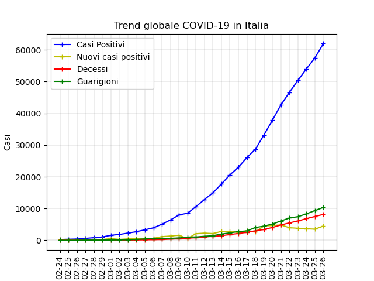
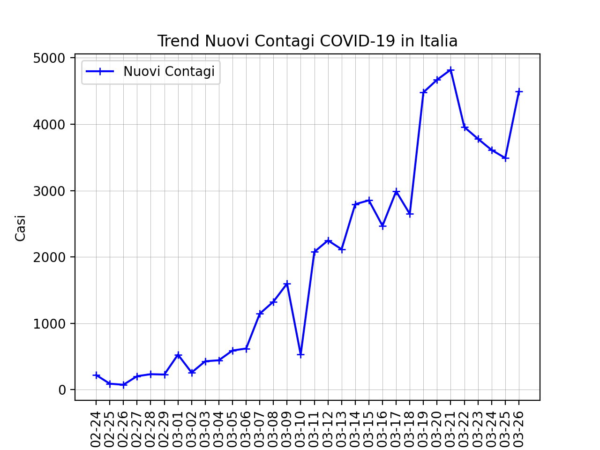

# covidbulletin_bot
Is Telegram bot project to get real-time informations about COVID propagation in Italy. 
Data source referenced is the following Official repo from Protezione Civile Italiana https://github.com/pcm-dpc/COVID-19

If you want to see how the bot is working try to open the telegram bot: (https://t.me/covidbulletin_bot).

***Please, use my code, but also reference my repository. This will be appreciated as an offered and fresh beer! :P ***


# Current Instance
Current instance is running on Google Cloud Platform account on a Virtual instance made by 2cpus and 4gb ram with Linux Ubuntu 16.04 installed. 
# Create a new instance, your Instance
## All you need is...

Computer or server service where to host the python scripts.
Create a Telegram bot and get the Token id of your new born bot.
Install ffmpeg in linux. Install firefox and download the related GeckoDriver

python3.7 intepreter with following modules installed: 

- json
- matplotlib
- urllib
- flask
- folium
- telepot
- selenium
- pyvirtualdisplay
- speech_recognition
- pydub


# Installation  

1. Run a `git clone https://github.com/altair1016/covidbulletin_bot` command or download files from my repo.
2. Create a new file `setup.json` containing a json file with the following structure:
```
{
    "tokenID": <BOT TOKEN>,
    "secretID" : <Unique Key to be generated>
}
```
3. Run python command `python3.7 flask_app.py` or `nohup python3.7 flask_app.py& ` to make it run in background and keep process running even after exiting the shell or terminal.

Following some example of images and trends that can be generated by python classes



